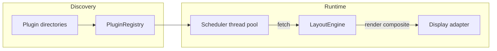

# MagInkMirror

MagInkMirror is a [MagicMirror](https://magicmirror.builders/)-style dashboard aimed at **e-paper displays** and Raspberry Pi. It composites **zones** on a fixed canvas, each zone driven by a **plugin** that fetches data on a schedule and renders with [Pillow](https://python-pillow.org/).

## Requirements

- Python **3.13+**
- A `config.toml` in the working directory (see the sample in this repo)

Install the package (from the repo root, using your preferred tool):

```bash
uv sync
```

Optional dependency groups (see `pyproject.toml`): `contrib` (e.g. Notion), `inky` (Inky displays), `svg` (SVG assets in some plugins).

## Running

```bash
maginkmirror run
```

Use `maginkmirror run --log-level DEBUG` for verbose logs. For layout debugging, `maginkmirror run --show-zones` draws zone boundaries once and exits.

To render a single plugin once to a PNG (useful when developing):

```bash
maginkmirror preview-plugin <plugin-or-zone-name> --out preview.png
```

Configuration is loaded from `config.toml`. Shared display settings live under `[display]`; fonts under `[fonts]`; and optional shared geolocation/timezone under `[location]` (merged into each plugin’s config—see below).

---

## Plugin system

Plugins are how MagInkMirror stays modular: each plugin **fetches** data on a timer and **renders** into its layout **zone**. The registry discovers them from disk; the scheduler runs `fetch()` in a thread pool; the layout engine calls `render()` on the main path and composites zones onto one image for the display driver.

### Discovery and load paths

The [`PluginRegistry`](src/maginkmirror/plugins/plugin_registry.py) scans, in order:

1. **`maginkmirror/plugins/`** — optional first-party plugin packages (each plugin is a **subdirectory** with `plugin.py`; this sits next to `base_plugin.py` and can hold e.g. `clock/plugin.py`).
2. **`maginkmirror/contrib/plugins/`** — bundled plugins shipped with the project (`clock`, `weather`, `rss`, `notion`, `pokemon`, `todoist`, …).
3. **Extra directories** from `plugin_dirs` in `config.toml` (list of absolute or relative paths).

Every plugin directory must be named by its **kind** (e.g. `weather`) and contain **`plugin.py`**.

### Plugin module contract

Inside `plugin.py`:

- Define a class that subclasses **`BasePlugin`** (from [`base_plugin.py`](src/maginkmirror/plugins/base_plugin.py)).
- Optionally set **`PLUGIN_CLASS = "MyPlugin"`** on the module. If omitted, the loader picks the **first** `BasePlugin` subclass found in the module.

The registry loads the file dynamically and instantiates the class with a merged **config dict** (see below).

### Lifecycle and API

`BasePlugin` requires:

| Piece | Role |
|--------|------|
| **`interval`** (class attribute, seconds) | How often the scheduler calls `fetch()`. |
| **`name`** | Short label for logs. |
| **`fetch()` → `PluginData`** | Load or compute data. May block; runs **off** the main thread. |
| **`render(data, image, zone)`** | Draw into the Pillow **`image`** (zone-sized buffer) for the given **`Zone`** (pixel rectangle and helpers). |

**`PluginData`** wraps:

- **`payload`** — any plugin-specific data for `render()`.
- **`error`** — optional message if the fetch failed; the scheduler can fall back to **last-good** data when appropriate.
- **`changed`** — set `False` to skip a repaint when nothing visual changed.
- **`metadata`** — optional dict for extras.

Rendering targets **1-bit or greyscale** (and optionally RGB composition when enabled in config); plugins should avoid heavy anti-aliasing that looks wrong on e-ink.

### Configuration merge order

The dict passed to `__init__` is built in [`_build_plugin_config`](src/maginkmirror/plugins/plugin_registry.py):

1. **`[location]`** — e.g. `timezone`, `latitude`, `longitude`, `place` (for clock, weather, …).
2. **`[plugins.<kind>]`** — settings for that plugin kind.
3. **`[fonts]`** — injected as `config["fonts"]` for shared font loading.

Plugin-specific tables use the **kind** name: `[plugins.clock]`, `[plugins.weather]`, etc.

### Enabling plugins

- If **`enabled_plugins`** is **omitted**, every discovered plugin under the search paths is instantiated (subject to layout pruning—see below).
- If **`enabled_plugins`** is set, it is a **whitelist** of kind names; only those are loaded from discovery.

### Layout zones and multiple instances

**`[layout.zones.<name>]`** maps a screen region to a plugin:

- **`plugin`** — the plugin **kind** (directory name).
- **`x`**, **`y`**, **`width`**, **`height`** — pixel geometry.

Reserved keys for routing/geometry: `plugin`, `x`, `y`, `width`, `height`. **Any other keys** in the zone table are **merged** into that zone’s plugin config (on top of `[location]` and `[plugins.<kind>]`). That is how you set per-zone API tokens, fonts, or feeds without duplicating global tables.

**Scheduler / registry key:**

- If the zone has **only** the reserved keys → the instance is keyed by the **kind** (e.g. `weather`).
- If the zone has **extra** keys → a **separate** plugin instance is registered under the **zone name** (e.g. `[layout.zones.notion]` with `token = "..."` → key `notion` for that instance).

After loading, **`prune_plugins_to_layout()`** removes plugin instances that **no** zone references, so the running set matches your layout.

### End-to-end flow



---

## Bundled plugins (contrib)

Under [`src/maginkmirror/contrib/plugins/`](src/maginkmirror/contrib/plugins/), each folder is one kind (`clock`, `weather`, `rss`, `notion`, `pokemon`, `todoist`, …). Enable them in layout and `[plugins.<kind>]` as needed; some integrations require env vars or optional dependencies (e.g. Notion via the `contrib` group).

---

## Project layout (high level)

| Area | Purpose |
|------|---------|
| `src/maginkmirror/main.py` | CLI (`run`, `preview-plugin`). |
| `src/maginkmirror/plugins/` | `BasePlugin`, `PluginRegistry`. |
| `src/maginkmirror/layout.py` | Zones, compositing, `instance_key` wiring. |
| `src/maginkmirror/scheduler.py` | Per-plugin intervals, `fetch()` execution. |
| `src/maginkmirror/display/` | Headless file output, Waveshare, IT8951, etc. |
| `config.toml` | Example configuration. |

For concrete keys and examples, start from the sample `config.toml` in this repository.
